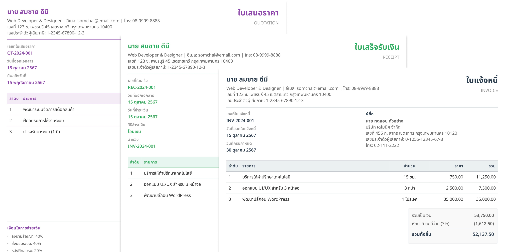

# Pacioli - Professional Financial Documents for Freelancers



> Named after **Luca Pacioli** (1494), the father of modern accounting and bookkeeping

Generate professional invoices, quotations, and receipts in seconds. Beautiful A4 PDFs with automatic Thai numbering, tax calculations, and customizable templates.

## Features

- **Zero configuration** - Start generating documents in 30 seconds with `bunx pacioli init`
- **Auto-numbering** - Sequential document numbers that reset monthly (INV-202511-001, INV-202511-002, etc.)
- **Thai tax support** - Automatic withholding tax and VAT calculations
- **Beautiful templates** - Professional HTML/CSS templates for each document type
- **Customizable** - Edit templates to match your branding
- **Customer database** - Reusable customer JSON files, no duplication
- **Bun-native** - Lightning fast with Bun runtime

## Quick Start

```bash
# Initialize project
bunx pacioli init

# Configure your profile
cp config/freelancer.example.json config/freelancer.json

# Generate your first invoice
bunx pacioli generate invoice examples/invoice.json --customer customers/acme-corp.json
```

That's it! Your PDF is ready in `output/invoice-INV-202411-001.pdf`

## Usage Overview

```bash
pacioli init                    # Initialize new project
pacioli generate invoice data.json --customer customer.json
pacioli generate quotation data.json --customer customer.json
pacioli generate receipt data.json --customer customer.json
```

For detailed documentation, see [USAGE.md](USAGE.md)

## Document Types

| Type | Use Case | Key Features |
|------|----------|--------------|
| **Invoice** | Bill for completed work | Due date, payment terms |
| **Quotation** | Price estimate before work | Validity period, optional milestones |
| **Receipt** | Payment confirmation | Payment date, method, reference |

## Why "Pacioli"?

Luca Pacioli (1445-1517) was an Italian mathematician and Franciscan friar who published the first comprehensive book on double-entry bookkeeping in 1494. His work, *Summa de arithmetica*, laid the foundation for modern accounting and is still used today. This tool honors his legacy by making financial document generation accessible to modern freelancers.

## Requirements

- **Bun** ≥ 1.0.0
- **Puppeteer** (installed automatically)

## Development

```bash
bun install
bun test
bun run dev init
```

## License

MIT

## Support

- **Issues**: https://github.com/peerasak-u/pacioli/issues
- **Discussions**: https://github.com/peerasak-u/pacioli/discussions

---

Made with ❤️ for freelancers everywhere
